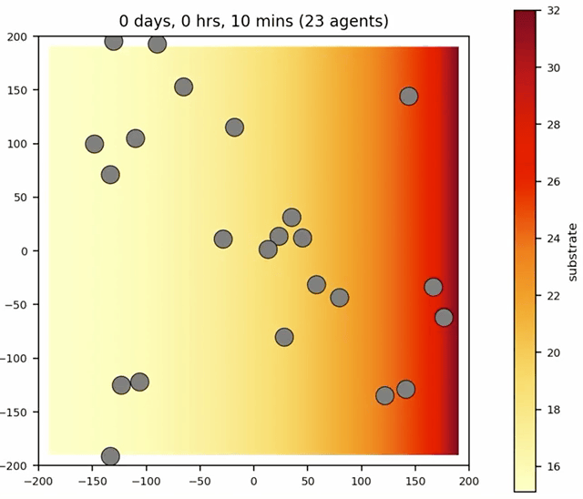

# periodic_bc

First attempt at providing periodic boundary conditions, but just for cell motility. 

Added new function: `standard_domain_edge_periodic_bc` in `core/PhysiCell_standard_models.cpp`.
Used it in `custom.cpp`:
```
    cell_defaults.functions.add_cell_basement_membrane_interactions = standard_domain_edge_periodic_bc;
```



To test, enable other microenv DC boundaries.

